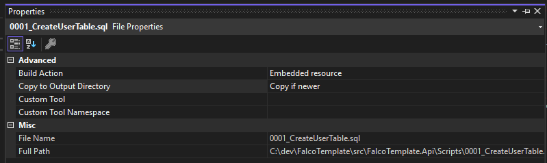

# Migrations with DbUp

This template utilizes DbUp to track Db migrations. How to create a new migration with DbUp.

* Create a new Sql file in this dirctory.
  * Increment the number on your script (if 0001 exists, new script becomes 0002)
* Ensure the script is an "Embedded Resource" and "Copy if newer" is selected.

  * Right click -> properties to open this sidebar
* When webapp starts up, it will migrate to latest